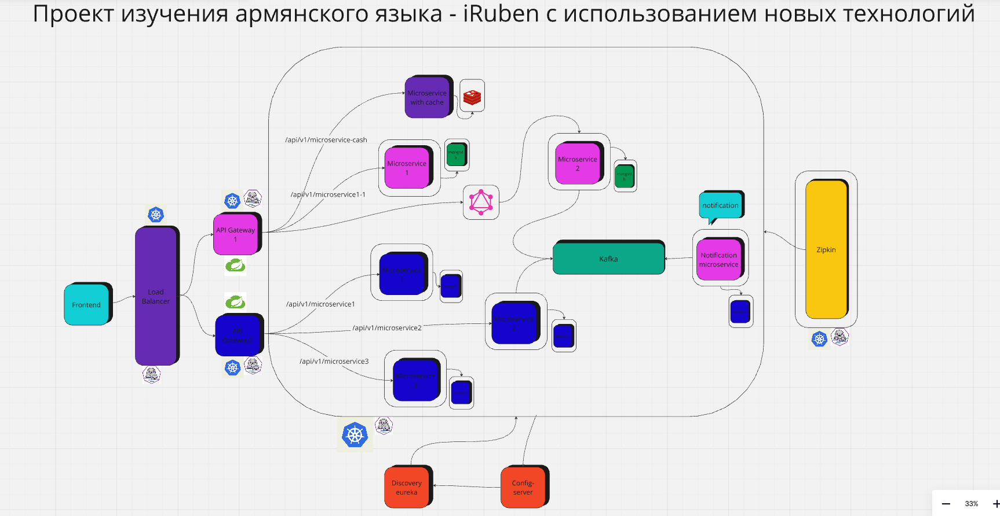

# Что было сделано на данный момент?
Сейчас я реализовал микросервис регистрации и аутентификации. Написал простой фронтенд для этого микросервиса. 
Отправляю запросы через фронт, получаю в ответе JWT-токен.
Храню его в localStorage для будущих запросов!

# Что в работе?
Работаю над сервисом изучения алфавита на языке Golang. 
# Архитектура начального проекта 
## (в будущем чутка изменю, так как будут связи между сервисами!)

